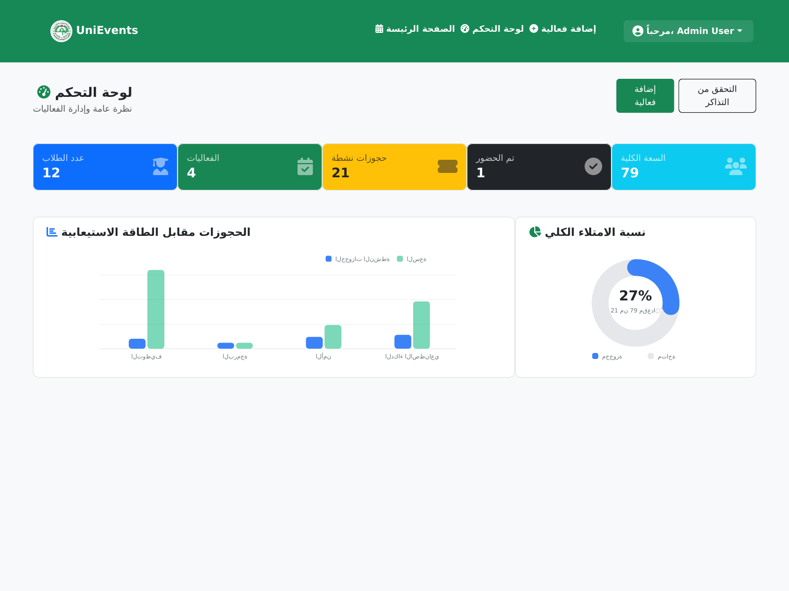
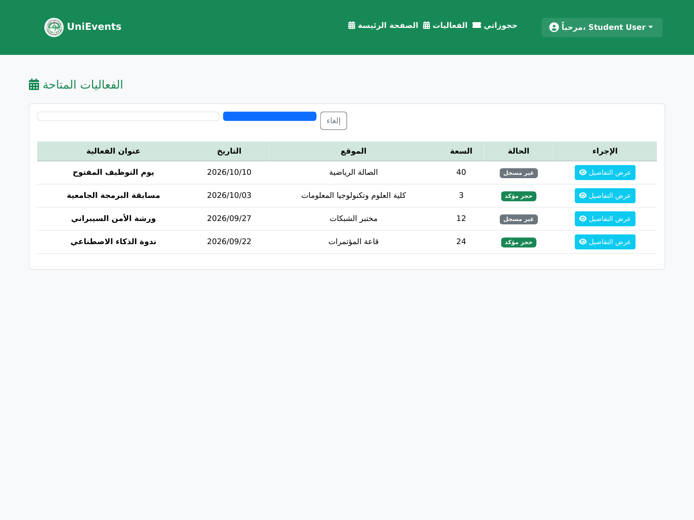

# UniEvents

University event management and booking system built with ASP.NET Core MVC and SQL Server. UniEvents gives students one place to discover and manage event bookings, while administrators can control capacity, waiting lists, attendance, reporting, and exports.

The interface is primarily Arabic and uses server-rendered Razor views.

## Product preview

### Admin dashboard

Live booking and capacity summaries, attendance metrics, event management, and registration exports.



### Student event browser

Searchable event catalogue with booking state, capacity, and access to each event workflow.



The screenshots above were generated from the current code using the opt-in in-memory demo dataset.

## What the system does

### Student workflow

- Sign in through a session-backed account.
- Browse and search university events by title or location.
- Book an available place or join the waiting list when capacity is full.
- Prevent duplicate active, waiting, or checked-in bookings for the same event.
- Review active, waiting, cancelled, and attended bookings.
- Open a valid ticket and download it as a PDF.
- Cancel a booking or leave the waiting list.

### Admin workflow

- View student, event, active-booking, attendance, and total-capacity metrics.
- Compare active bookings with event capacity and review the overall fill rate.
- Create, edit, and delete events.
- Prevent capacity from being reduced below the number of confirmed attendees.
- Review registered students by booking state.
- Verify a ticket by booking ID and record attendance.
- Export event registrations to Excel.

## Booking lifecycle

UniEvents stores each registration in one of four states:

| State | Meaning |
| --- | --- |
| `active` | The student has a confirmed place. |
| `waiting` | The event is full and the student is queued. |
| `checkedin` | The booking was verified and attendance was recorded. |
| `cancelled` | The student cancelled the booking or left the queue. |

When a confirmed booking is cancelled, the earliest waiting registration is promoted automatically. Increasing an event's capacity also promotes waiting registrations in FIFO order until the new places are filled.

## Technology

- .NET 8 and ASP.NET Core MVC
- C# controllers and Razor views
- Entity Framework Core 8
- SQL Server with EF Core migrations
- Optional EF Core in-memory provider for local demos
- Bootstrap 5 RTL, Font Awesome, and Chart.js
- BCrypt password hashing
- QuestPDF ticket generation with a bundled Noto Sans Arabic font
- ClosedXML Excel exports

## Run locally

### Prerequisites

- [.NET 8 SDK](https://dotnet.microsoft.com/download/dotnet/8.0)
- SQL Server LocalDB or another SQL Server instance for the persistent database mode

### Fast demo mode (cross-platform)

Demo mode uses an in-memory database, creates sample users, events, and bookings, and resets whenever the process stops.

Linux or macOS:

```bash
Database__Provider=InMemory dotnet run --project project/project.csproj --launch-profile http
```

Windows PowerShell:

```powershell
$env:Database__Provider = "InMemory"
dotnet run --project project/project.csproj --launch-profile http
```

Open `http://localhost:5284` and use either account:

| Role | Email | Password |
| --- | --- | --- |
| Admin | `admin@example.com` | `Admin123!` |
| Student | `student@example.com` | `Student123!` |

These seeded credentials are intended only for local development and demonstrations. Demo data is disabled by default for SQL Server mode and should never be enabled in production.

### SQL Server mode

SQL Server remains the default provider. Update `ConnectionStrings:DefaultConnection` in `project/appsettings.json` when you are not using the included LocalDB connection, then run:

```bash
dotnet run --project project/project.csproj
```

The application applies pending EF Core migrations during startup.

For a disposable local SQL Server database, opt in to the same sample accounts, events, and bookings with `Database__SeedDemoData=true`. A production database should use separately provisioned accounts and must not enable this flag.

## Verify the build

```bash
dotnet restore project/project.csproj
dotnet build project/project.csproj --configuration Release
```

## Project structure

```text
project/
├── Controllers/    # Student, admin, login, and profile workflows
├── Models/         # EF Core entities and database context
├── Views/          # Arabic Razor interfaces
├── Migrations/     # SQL Server schema history
├── wwwroot/        # Static assets
└── Program.cs      # Services, database selection, seeding, and middleware
```

## Related links

- [Project walkthrough on LinkedIn](https://www.linkedin.com/posts/adham-abuhager_aspnetcore-csharp-webdevelopment-activity-7419815597057769473-JEmn)
- [Adham Abu Hager's portfolio](https://adhamabuhagerdev.site/)
